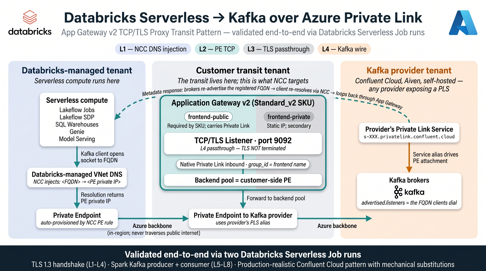

# Pattern Reference — Databricks Serverless → Kafka over Azure PrivateLink

A distilled, opinionated reference for the architecture pattern this repo
implements. **Read this first** if you're applying this pattern to a new
customer; the deeper documents this links to are reference material.

## TL;DR

To privately connect Databricks Serverless compute to a Kafka service that
sits behind Azure PrivateLink — whether that's Confluent Cloud, a self-
hosted broker, or a managed Kafka offering — you need a **customer-tenant
transit** that sits in between. The transit is mandatory because of three
independent Azure / Databricks platform constraints (any one alone forces
it). The recommended transit in 2026 is **Azure Application Gateway v2
with a TCP/TLS proxy listener** (GA since 2025-11-26), which gives you a
managed-PaaS proxy with native Private Link inbound. The TCP/TLS listener
passes through TLS end-to-end without termination — App Gateway sees only
encrypted bytes.

Databricks-side, you create a **single NCC private-endpoint rule** that
targets the App Gateway's Azure Resource ID. The rule's `group_id` is the
name of the App Gateway frontend IP configuration (not the PL config name —
common gotcha). The rule's `domain_names` are the FQDNs that Kafka clients
on Serverless will dial; NCC injects DNS so those names resolve to a
Databricks-managed PE IP inside the Serverless VNet.

The pattern has been empirically validated end-to-end: a Databricks
Serverless Job successfully drove a Spark Kafka producer + consumer (20
messages, 20/20 round-trip match) through an App Gateway TCP proxy backed
by a real Apache Kafka broker. See [Validated evidence](#validated-evidence)
for the run URLs.

## The pattern in one diagram



A text-only version follows for terminals and accessibility:


```
┌──────────────────────────────────────────────────────────────────────────────┐
│ DATABRICKS-MANAGED TENANT                                                    │
│                                                                              │
│  Serverless compute (Lakeflow Jobs / SDP / SQL / Genie / Model Serving)      │
│        │                                                                     │
│        │  Kafka client opens socket to FQDN registered in NCC                │
│        │  glibc resolver → Databricks-managed VNet DNS                       │
│        │  NCC has injected: <FQDN> → <PE private IP>                         │
│        ▼                                                                     │
│  Private Endpoint (auto-provisioned by NCC PE rule)                          │
│        │                                                                     │
└────────┼─────────────────────────────────────────────────────────────────────┘
         │ Azure backbone (in-region; no public internet)
         ▼
┌──────────────────────────────────────────────────────────────────────────────┐
│ CUSTOMER TENANT — transit subscription / VNet                                │
│                                                                              │
│  Application Gateway v2 (Standard_v2 SKU)                                    │
│   • TCP/TLS listener on Kafka port (e.g., 9092 or 9094 for TLS)              │
│   • Native Private Link inbound (frontend-public has PL config attached)     │
│   • Public IP frontend (required by SKU unless feature flag registered)      │
│   • Backend pool addresses an IP in this VNet                                │
│        │                                                                     │
│        ▼                                                                     │
│  Backend = Private Endpoint to the Kafka service's PLS                       │
│   (Confluent Cloud's PLS alias, self-managed Kafka's customer PLS, etc.)     │
│        │                                                                     │
└────────┼─────────────────────────────────────────────────────────────────────┘
         │ Azure backbone
         ▼
┌──────────────────────────────────────────────────────────────────────────────┐
│ KAFKA SERVICE TENANT                                                         │
│                                                                              │
│  Provider's Private Link Service (Confluent Cloud, Aiven, self-hosted, …)    │
│        │                                                                     │
│        ▼                                                                     │
│  Kafka broker(s) with `advertised.listeners` = the FQDN clients dial         │
│  (so the metadata round-trip loops back through the same NCC + App GW path)  │
└──────────────────────────────────────────────────────────────────────────────┘
```

## Five things to know (in order of how often each bites people)

### 1. The transit cannot be designed away

Three independent constraints all force it:

| # | Constraint | Implication |
|---|---|---|
| (a) | **NCC accepts only Azure Resource IDs**, not PrivateLink aliases | The Kafka provider's PLS alias (cross-tenant) cannot be the NCC target |
| (b) | **The provider's PLS visibility allow-list rarely includes Databricks' managed serverless subscription IDs** | Even if NCC could accept aliases, the PE creation would be rejected |
| (c) | **Azure Standard Load Balancer cannot have Private Endpoint IPs as backend pool members** | A naive "SLB → backend = provider PE IP" design fails at provisioning |

A customer-tenant App Gateway in the middle satisfies all three: NCC targets a Resource ID Coles owns, the App GW backend can be a PE IP (unlike Standard LB), and Coles' visibility on the App GW is theirs to control.

See [`why-transit.md`](why-transit.md) for the long-form rationale.

### 2. App Gateway v2 TCP/TLS proxy is the recommended transit (GA 2025-11-26)

The repo also implements a VMSS+HAProxy transit alternative (`modules/vmss-haproxy-transit/`). Use it only when cost dominates — App Gateway v2 is ~$200/mo vs ~$60/mo for the homegrown stack. The trade-off is operational ownership: App GW is fully managed (patching, scaling, SLA); HAProxy you own end to end.

For the App GW v2 listener:
- SKU: **Standard_v2** (or WAF_v2, but WAF doesn't inspect TCP/TLS so the upcharge is wasted)
- Protocol: `"Tcp"` on listener + backend settings (passes through TLS-encrypted bytes if the application uses TLS, plaintext if it doesn't)
- API version: **`2024-05-01`** via the `azapi` provider (the `azurerm` provider still doesn't expose TCP listeners as of 2026-05)

### 3. The TCP/TLS listener does **not** terminate TLS

The "TLS" in the name refers to TLS SNI inspection capability (the listener can read the cleartext `ClientHello.SNI` to make routing decisions without decrypting the payload). It is **not** a TLS termination proxy.

End-to-end encryption from the Spark client to the Kafka broker is preserved. The peer cert the client sees is the *broker's* cert, not App Gateway's. We validated this empirically — see [Validated evidence](#validated-evidence).

### 4. The NCC PE rule's `group_id` is the **frontend IP config name**, not the PL config name

This is the single most counter-intuitive gotcha. When Databricks NCC creates a PE pointing at the App Gateway, Azure resolves the `group_id` against the App Gateway's exposed private-link "subResources" — which are named after the **frontend IP configs** that have a `privateLinkConfiguration` attached, **not** after the PL config itself.

If your App Gateway has:
- A frontend named `frontend-public` with `privateLinkConfiguration` set to `pl-config`
- A PL config named `pl-config`

Then the NCC PE rule needs `"group_id": "frontend-public"`. Using `"pl-config"` returns Azure's misleading "no private link configuration" error.

Discover the correct value with:

```bash
az network private-link-resource list --type Microsoft.Network/applicationGateways \
  --name <appgw> --resource-group <rg> --query "[].properties.groupId"
```

The current `modules/databricks-ncc-confluent/variables.tf` defaults `group_id` to `"confluent-kafka"` — this default has never worked end-to-end. Override it explicitly per deployment, or fix the module default to require an override.

### 5. Kafka Connect on Kubernetes is parallel infrastructure, not in this path

Customers running self-hosted Kafka Connect on AKS sometimes describe it as a connectivity requirement alongside Databricks-to-Kafka. It isn't. Connect workers source data from operational systems (CDC, application events) and write to Kafka topics; they run on AKS because the *source* systems are on-prem or in the customer VNet. Connect's relationship to this architecture:

- Connect workers reaching the Kafka cluster → customer-side outbound (independent of Databricks)
- Operators reaching Connect's REST API on port 8083 → customer intranet (independent of Databricks)
- Databricks reaching Connect's REST API → almost never required; Databricks consumes topics directly via Spark Kafka source, not Connect's control plane

If a customer ever does need Databricks → Connect REST, it would be a *second* NCC PE rule + transit chain, on a different port. Defer until specifically asked.

## Validated evidence

Two Databricks Serverless Job runs prove the pattern works end-to-end in a real Azure subscription. Each successful run produces a durable, shareable URL in the workspace Jobs UI of the form `<workspace-host>/jobs/runs/<run-id>`.

| Test | What it proves |
|---|---|
| **L1-L4 — Network + TLS path** (`submit_job.py`) | TLS 1.3 handshake between a Serverless worker and a self-signed TLS backend (socat OPENSSL-LISTEN) completes through the App Gateway TCP/TLS listener. Cipher `TLS_AES_256_GCM_SHA384`. Peer cert returned to client is the backend's. App GW never sees plaintext. |
| **L5-L8 — Kafka protocol** (`submit_kafka_job.py`) | Spark's `df.write.format("kafka")` produces N messages to a topic; `spark.read.format("kafka")` consumes them back; full round-trip match. Validates the two-hop FQDN re-resolution behaviour (bootstrap → metadata → re-dial `advertised.listeners` → second connection through the same NCC + App GW path). |

Reproduce either against your own workspace with `examples/appgw-smoke-test/submit_job.py` (TLS) or `examples/appgw-smoke-test/submit_kafka_job.py` (Kafka). Both print the workspace-side run URL on success.

## The deployment gotchas (the 12-item checklist)

If you skip every other section of this document, **read this one**. These bit
us during validation; the smoke-test code now handles each.

| # | Gotcha | Mitigation |
|---|---|---|
| 1 | Azure VMs reject ED25519 SSH keys | Use RSA 2048 in `tls_private_key` resources |
| 2 | Databricks provider auth picks the wrong tenant when az-cli has guest access to multiple tenants | Pass explicit `azure_tenant_id` on the provider block |
| 3 | App GW v2 Standard_v2 SKU won't deploy without a public IP (unless `EnableApplicationGatewayNetworkIsolation` feature flag is registered on the sub — slow / unpredictable) | Provision an unused public IP frontend; bind listener to a private frontend |
| 4 | App GW v2 private frontend IP must be Static allocation | `privateIPAllocationMethod = "Static"` + explicit `privateIPAddress` |
| 5 | NCC PE rule rejects reserved TLDs (`.internal`, `.local`, `.test`) | Use a real-public-looking domain; `*.example.com` is RFC 2606 reserved for testing |
| 6 | Subscription-level resource locks (common in FE sandboxes) block VM replacement on cert / cloud-init drift | `lifecycle.ignore_changes = [custom_data, admin_ssh_key]` on Linux VM |
| 7 | App GW PE `group_id` is the **frontend name**, not the PL config name | Use `az network private-link-resource list` to discover the correct value |
| 8 | App GW PL config must be **bound to** a frontend IP config (one-direction reference is not enough; the frontend must reference the PL config) | `frontendIPConfigurations[].properties.privateLinkConfiguration` is set on the frontend |
| 9 | `az network application-gateway private-link list` CLI sub-command returns empty even when PE connections exist | Approve PEs via raw `az rest PUT` to `/privateEndpointConnections/<name>` |
| 10 | `databricks-connect>=18.2.0` is incompatible with Serverless sessions | Pin to `>=18.1,<18.2`, Python 3.12 in `pyproject.toml` |
| 11 | Kafka broker's `advertised.listeners` must match the FQDN registered in NCC | Otherwise the metadata round-trip works once but the second-hop connection fails. Add `/etc/hosts` on the broker VM so local admin tools can resolve the advertised name |
| 12 | App GW v2 provisioning takes ~20-25 min on first apply; partial-failure-and-retry is the norm during iteration | Plan apply time; terraform's incremental convergence handles partial state cleanly |

## How to deploy

### For a real customer

1. **Read [`why-transit.md`](why-transit.md)** — internalise the three constraints. This is your customer-facing rationale.
2. **Fork `examples/full-stack/`** — that's the production caller. It wires `modules/appgw-transit/` and `modules/databricks-ncc-confluent/` together.
3. **Substitute the Kafka target** — replace the backend pool IP with a Private Endpoint to the provider's PLS (Confluent Cloud, self-hosted, etc.). For Confluent Cloud: `azurerm_private_endpoint.confluent` with `private_connection_resource_alias = "<confluent alias>"`.
4. **Register the right NCC FQDNs**:
   - Confluent Cloud cluster FQDN: `<lkc-cluster-id>.<network-id>.<region>.azure.confluent.cloud`
   - Wildcard for broker re-resolution: `*.<network-id>.<region>.azure.confluent.cloud`
   - Confluent Schema Registry (if used): `psrc-<id>.<region>.azure.confluent.cloud` (separate NCC PE rule + transit chain)
5. **Walk the 12-item gotcha checklist** before terraform apply.
6. **Validate** by re-running `submit_kafka_job.py` against the target before customer sign-off.

### For a smoke test in a new sandbox

Just deploy `examples/appgw-smoke-test/`. It's self-contained, runs in ~25 min, validates L1-L4 immediately and gives you the toolchain to add L5-L8 (Kafka producer/consumer) afterwards.

## How to adapt for variants

| Variant | What changes |
|---|---|
| **Confluent Cloud Dedicated/Enterprise** | Backend = PE to `s-<id>.privatelink.confluent.cloud`. Register the cluster FQDN + wildcard. |
| **Confluent Cloud Standard (no Private Link)** | This pattern doesn't apply — Standard clusters require public IP allowlisting. Use NCC stable outbound IPs instead, no transit needed. |
| **Self-hosted Kafka on AKS** | Backend = PE to a PLS the customer creates on a Standard LB fronting their broker pods. Per-broker addressability handled via `advertised.listeners` + multiple LB rules or one PLS per broker. |
| **Aiven for Apache Kafka** | Same as Confluent Cloud structurally — Aiven offers a PrivateLink endpoint per cluster. Substitute the alias and FQDN. |
| **Multi-region with DR** | App Gateway is regional. For DR, deploy a second App GW + NCC PE rule in the DR region. Spark Kafka source's `bootstrap.servers` can list both regions' FQDNs. |
| **TLS to broker required (mTLS)** | App GW config unchanged (it doesn't terminate TLS). Add client cert/key as Databricks secrets, reference in `kafka.ssl.keystore.*` Spark options. |

## What this pattern does NOT cover

- **The Databricks workspace itself.** Front-end PrivateLink to the workspace (PE to `databricks_ui_api`) is a separate decision documented in workspace setup playbooks, independent of this outbound-from-Serverless work.
- **Unity Catalog storage access.** Storage credentials, access connectors, and Unity Catalog metastore connectivity are orthogonal — they use their own NCC PE rules with different `group_id` values.
- **Kafka Connect REST API access.** See section 5 above.
- **CDC source connectivity from Connect workers.** Customer-side intranet concern.

## See also

- [`why-transit.md`](why-transit.md) — the long-form rationale for the three constraints + the Connect-on-K8s clarification
- [`../README.md`](../README.md) — top-level architecture diagrams for both transit options (App Gateway and VMSS+HAProxy)
- [`../examples/appgw-smoke-test/`](../examples/appgw-smoke-test/) — the validated harness; clone-and-deploy in a sandbox
- [`../examples/full-stack/`](../examples/full-stack/) — production caller pattern
- [`../modules/appgw-transit/`](../modules/appgw-transit/) — App Gateway v2 transit module (recommended)
- [`../modules/vmss-haproxy-transit/`](../modules/vmss-haproxy-transit/) — VMSS+HAProxy transit module (cost-saver alternative)
- [`../modules/databricks-ncc-confluent/`](../modules/databricks-ncc-confluent/) — NCC + PE rule + workspace binding module
